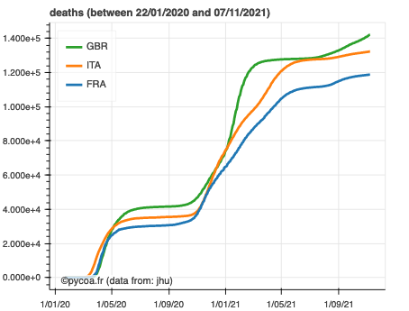

# Graphiques
## Plot
* Pour faire un tracé, le lieu doit impérativement être spécifié avec l'option `where`, qui peut comporter un pays unique, une région du monde, ou plusieurs pays, ou plusieurs régions, ou un mélange de pays et de régions. Par défaut, l'ensemble des lieux disponibles est pris en compte pour `where`. Les données à tracer sont précisées par l'option `which` (par défaut, décès de la CoVid19, mot clef `deaths`), et le type de données par l'option `what` (par défaut `cumul`, i.e. en mode cumulatif). Ainsi :

```python
cf.plot(where=['France', 'Italy', 'United kingdom'], which='deaths', what='cumul')
```
effectue le tracé de la série temporel du nombre de décès dans 3 pays européens en mode cumulatif.

Dans cet exemple, les mots clefs choisis pour `which` et `what` étant ceux par défaut, on aurait pu tout aussi bien écrire :

```python
cf.plot(where=['France', 'Italy', 'United kingdom'])
```



Le tracé s'effectue par l'intermédiaire de la librairie `bokeh` qui permet de rendre les figures intéractives. Sur la figure l'ongle `log`permet de passer l'echelle des ordonnées en Log.  
On pourra effectuer des zooms ou bien de sauvegarder la figure. Par ailleurs, en interactif, on pourra utiliser le curseur pour avoir des informations à tel ou tel instant pour telle ou telle courbe. Cliquer une des courbes dans la légende permet de le faire disparaitre ou le réapparaitre.

* Le choix pour les données tracées s'effectue donc au travers les mots clefs `which` et `what`. Pour avoir la liste des options possibles :
```python
cf.listwhich()
```
> `['deaths', 'confirmed', 'recovered']`
c'est-à-dire _décès_, _cas confirmés_, _cas guéris_.

```python
cf.listwhat()
```
> `['cumul', 'daily', 'weekly']`
Il s'agit successivement :
 - des _données cumulées_,
 - des données _différentielles_ journalières,
 - des données _différentielles_ hebdomadaires.

 On peut également ajouter un champ de date d'intérêt au travers l'option `when` qui comprend soit 1 soit 2 dates successives, au format jj/mm/aaaa.
  - lorsqu'une unique date est donnée, cela donne la borne de fin du lot de données.
  - lorsque deux dates sont données, séparées par `:` , cela définit la tranche temporelle pour les données.

Il est enfin possible d'ajouter des options. La liste de celles-ci est accessible avec la fonction

```python
cf.listoption()
```
> `['nonneg', 'nofillnan', 'smooth7', 'sumall']`
Par défaut aucun option n'est spécifiée.
Les options correspondent à :
- `nonneg`, qui s'applique aux données cumulées qui doivent être croissantes, et qui corrige les données non croissantes afin d'avoir un différentiel journalié positif ou nul
- `nofillnan`. Par défaut, les valeurs invalides (`NaN` des données sont remplis avec les données des jours précédents. Avec cette option, les données invalides ne sont pas remplies.
- `smooth7` effectue un moyennage glissant sur 7 jour centré
- `sumall` effectue la somme des valeurs pour tous les lieux précisés.

Il est possible de cumuler plusieurs options. Par exemple :
```python
cf.plot(where='European Union',option=['sumall','smooth7'])
```

À propos de la localisation choisie au travers le mot clef `where`, la liste des régions disponibles est accessible via la fonction
```python
cf.listregion()
```
* `plot` accepte l'argument `typeofplot`; Par default celui-ci est `date` ce qui signifie que le plot sera une evolution temporelle.
  * `typeofplot='menulocation'`
```python
cf.plot(where='European Union',typeofplot='menulocation')
```


  * `typeofplot='versus'` Voir plus dans la section avancé
