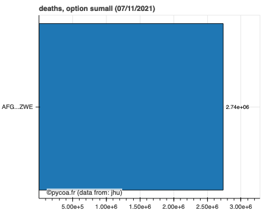
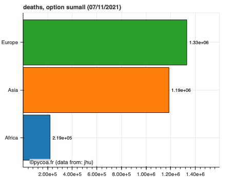
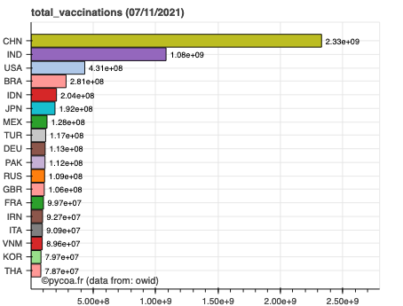
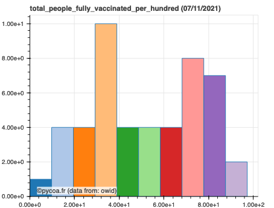
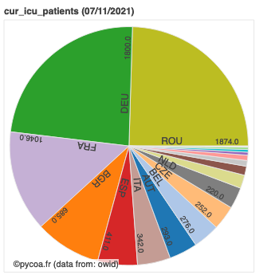
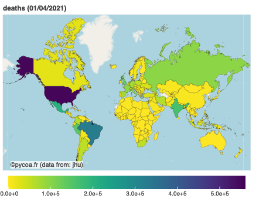
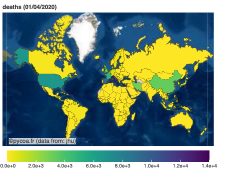
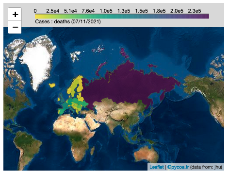
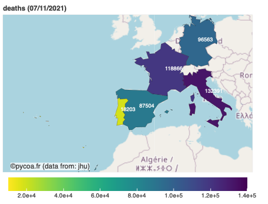
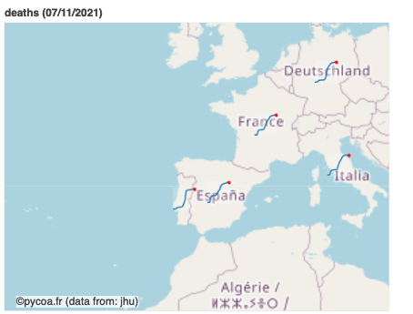

# Graphiques
## Histogramme
* Il est possible de faire des sommes partielles de données pour des régions entières en utilisant la notation à double crochets. Ainsi, par exemple pour un histogramme :
```python
cf.hist(where=[['asia','africa','europe']],option='sumall')
```

* Il est egalement possible de faire des sommes semi partielles de données
```python
cf.hist(where=[['asia'],['africa'],['europe']],option='sumall')
```



* Production d'histogramme
Il s'agit du même type de traitement que pour les cartes (données à une date donnée, soit la dernière enregistrée, soit précisée par le champ `when=...'`). Au lieu d'une représentation géographique des données, celles-ci sont sous forme d'un histogramme pour le type de données choisies.

Deux types d'histogrammes sont possibles. Soit par localisation (par défaut)
```python
cf.setwhom('owid') # changing database
cf.hist(which='total_vaccinations') # default is for all countries
```


Soit par valeur :
```python
cf.hist(which='total_people_fully_vaccinated_per_hundred',typeofhist='byvalue',where='asia')
```
fournissant ainsi l'histogramme pour tous les pays d'Afrique Centrale du nombre de cas confirmés.



Soit sous forme d'un camembert :
```python
cf.hist(which='cur_icu_patients',typeofhist='pie',where='european union')
```
qui donne la répartition des patients en soins intensifs dans les pays de l'Union Européenne.



* dateslider=True

## Carte

* Pour réaliser une carte, les arguments sont les mêmes. Mais on fait appel à la fonction `map`. Le champ de données tracé correspond à celui du dernier jour de données disponible. Ainsi
```python
cf.map(where=['world'],what='daily',when='01/04/2020')
```
produit une carte du monde du nombre de décès quotidien (mot clef `which='deaths'` par défaut), type de donnée différentiel `'daily'` au 1er avril 2020. En mode interactif dans un _notebook_, il est possible de déplacer le curseur sur chaque pays pour avoir une information quantitative sur celui-ci. Il est aussi possible d'effecter des zooms.



Même carte avec le fond 'esri', `tile='esri'``

```python
cf.map(where=['world'],what='daily',when='01/04/2020',tile='esri')
```



L'ensemble des `tiles` disponibles
```python
cf.listtile()
```
> ['openstreet', 'esri', 'stamen', 'positron']

Par defaut les cartes demandées sont des images. On peut vouloir avoir une vraie carte de type `folium`
```python
cf.map(where=['Europe'],what='weekly',tile='positron', visu='folium')
```



```python
cf.map(where=['FRA','ESP','PRT','GER','ITA'], maplabel = 'text')
```




```python
cf.map(where=['FRA','ESP','PRT','GER','ITA'], maplabel = 'spark')
```


